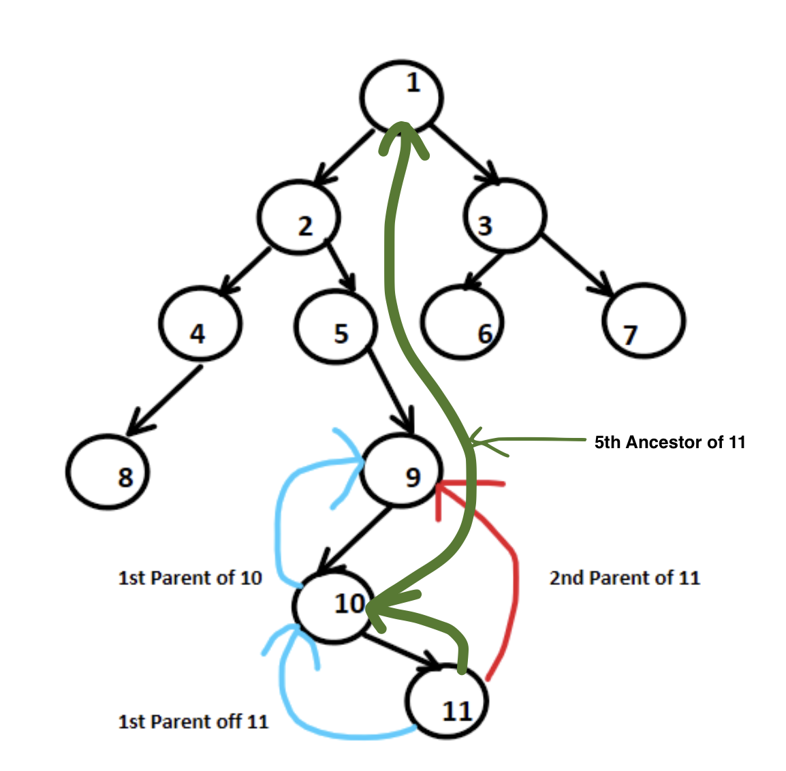
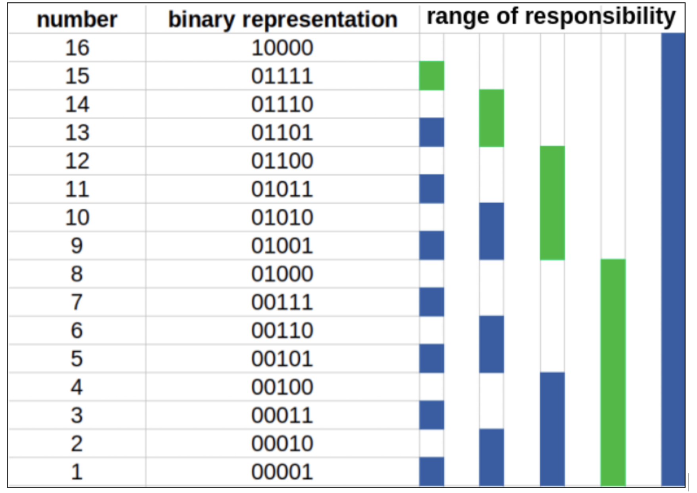
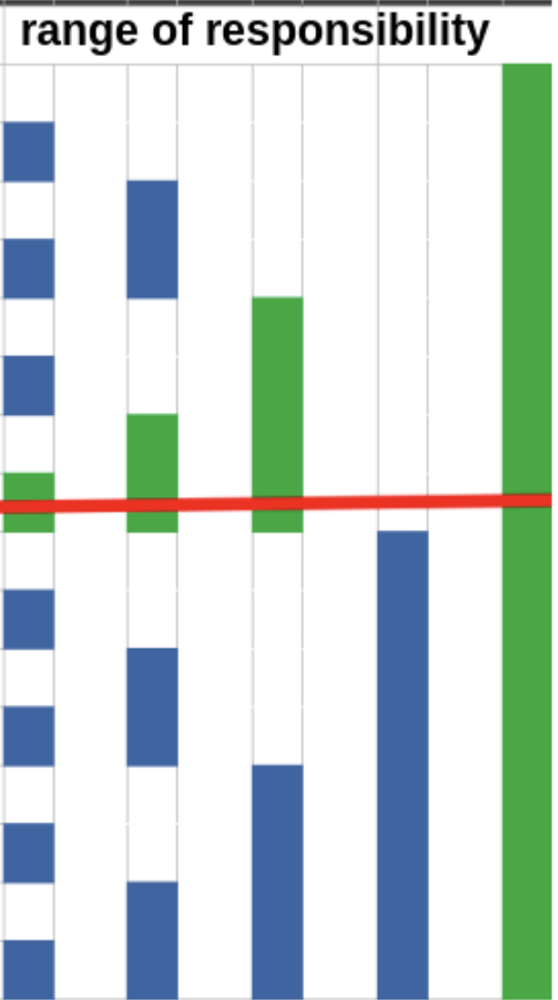

# Binary Lifting
>In some class of problem, we are required to return k-th ancestor of a node in a tree multiple times for different nodes or LCA(Lowest Common Ancestor) we have compute repeatedly.

<div align="center">

</div>

```md
# distance between node 8 & 9, how do we find that
    We can reach 9 from 8 via 8>4>2>5>9 which can be re-arranged and written as 1->2>4>8 + 1->2>5->9 and subtracting 1-2 (twice as this is not required)
    More generically we can write as

#           distance (u, v) = depth[u] + depth[v] - 2 * depth [LCA(u,v)]

computing 2^1 parent(2nd parent) of node 11. As see this can be computed using previous node 2^0 parent.
```

```md
# LeetCode - 1483
You are given a tree with n nodes numbered from 0 to n - 1 in the form of a parent array parent where parent[i] is the parent of ith node. The root of the tree is node 0. Find the kth ancestor of a given node.
The kth ancestor of a tree node is the kth node in the path from that node to the root node.
Implement the TreeAncestor class:
TreeAncestor(int n, int[] parent) Initializes the object with the number of nodes in the tree and the parent array.
int getKthAncestor(int node, int k) return the kth ancestor of the given node node. If there is no such ancestor, return -1.
```
```java
class TreeAncestor {
    int maxDepth=0,kthParentOfNode[][];
    public TreeAncestor(int n, int[] parent) {
        maxDepth=(int)Math.ceil(Math.log(n)/Math.log(2))+1;
        kthParentOfNode=new int[maxDepth][n];
        for(var arr:kthParentOfNode)Arrays.fill(arr,-1);
        for(int k=0;k<maxDepth;k++) for(int node=0;node<n;node++){
            if(k==0)kthParentOfNode[k][node]=parent[node];
            else if(kthParentOfNode[k-1][node]!=-1)
                kthParentOfNode[k][node]=kthParentOfNode[k-1][kthParentOfNode[k-1][node]];
        }
    }
    public int getKthAncestor(int node, int k) {
        int res=-1;
        for(int i=0;i<maxDepth;i++) if((k & (1<<i))!=0){
            node=kthParentOfNode[i][node];
            if(node==-1)break;
        }
        return node;
    }
}
```

```md
# how to find LCA when we have pre-computed kthParentOfNode

LCA (u, v)
Steps :

1. First bring both the node to same depth level.
2. There could be a case where both u and v are same after Step 1, so check and return parent[u] .
3. If Step 2 is not the case then either iterativel or binary search find the last node, where both there parent are different.
4. return parent[u] 


# parent[node], depth[node] can be known from DFS
```
```java
int getLCA(int u, int v){
    if(depth[u] > depth[v]) swap(u, v);
    int diff = depth[v] - depth[u];
    v = getKth(v , diff) ; // v is on deeper ;evel, so we need to lift it up
    if(u==v) return u; // case where both node are originally in same subtree
        
    for(int i = maxD; i>=0 ; --i){
        int newU = kthParentOfNode[i][u],newV = kthParentOfNode[i][v];
        if(newU==newV) continue; // that means we are yet to find something not common, 
        u = newU;
        v = newV;
    }
    // now here we have explored all the depth and now u and v parent is LCA
    return parent[u];
}
```

# Fenwick Tree or Binary Index Tree [ BIT ]

<div align="center">


</div>

```md
# Range-update and point-queries
The Fenwick tree is initialized with zeros. Suppose that we want to increment the interval [l,r] by x. We make two point update operations on Fenwick tree which are update(l, x) and update(r + 1, -x). If we want to get the value of ith position, we just need to take the prefix sum using the ordinary range sum method.
```

```md
# LeetCode - 307
Given an integer array nums, handle multiple queries of the following types:

Update the value of an element in nums.
Calculate the sum of the elements of nums between indices left and right inclusive where left <= right.
Implement the NumArray class:
NumArray(int[] nums) Initializes the object with the integer array nums.
void update(int index, int val) Updates the value of nums[index] to be val.
int sumRange(int left, int right) Returns the sum of the elements of nums between indices left and right inclusive (i.e. nums[left] + nums[left + 1] + ... + nums[right]).
```

```java
class BIT { // one-based indexing
    int bit[];
    BIT(int size) {
        bit = new int[size + 1];
    }
    int getSum(int idx) { // Get sum in range [1..idx]
        int sum = 0;
         while (idx > 0 ){
            sum+=bit[idx];
            idx -= idx & (-idx);
        }
        return sum;
    }
    int getRangeSum(int left, int right) { // left, right inclusive
        return getSum(right) - getSum(left - 1);
    }
    void update(int idx, int val) { 
        while (idx < bit.length ){
            bit[idx] += val;
            idx += idx & (-idx);
        }
    }
}
class NumArray {
    BIT bit;
    int[] nums;
    public NumArray(int[] nums) {
        this.nums = nums;
        bit = new BIT(nums.length);
        for (int i = 0; i < nums.length; ++i) bit.update(i+1, nums[i]);
    }
    public void update(int index, int val) {
        int diff = val - nums[index]; 
        bit.update(index + 1, diff); 
        nums[index] = val; 
    }
    public int sumRange(int left, int right) {
        return bit.getSum(right+1) - bit.getSum(left);
    }
}
```

# Game Theory

### 1. Games on arbitrary graphs
https://cp-algorithms.com/game_theory/games_on_graphs.html
#### MiniMax - approach
```md
# LeetCode - 913
A game on an undirected graph is played by two players, Mouse and Cat, who alternate turns.

The graph is given as follows: graph[a] is a list of all nodes b such that ab is an edge of the graph.

The mouse starts at node 1 and goes first, the cat starts at node 2 and goes second, and there is a hole at node 0.

During each player's turn, they must travel along one edge of the graph that meets where they are.  For example, if the Mouse is at node 1, it must travel to any node in graph[1].

Additionally, it is not allowed for the Cat to travel to the Hole (node 0).

Then, the game can end in three ways:

If ever the Cat occupies the same node as the Mouse, the Cat wins.
If ever the Mouse reaches the Hole, the Mouse wins.
If ever a position is repeated (i.e., the players are in the same position as a previous turn, and it is the same player's turn to move), the game is a draw.
Given a graph, and assuming both players play optimally, return

1 if the mouse wins the game,
2 if the cat wins the game, or
0 if the game is a draw.
```
```java
private int helper(int[][] graph, int cat, int mouse, int turn, Integer[][][][] dp,int totalTurns) {
    if (cat == mouse) return -1;
    if (mouse == 0) return 1;
    if (totalTurns == graph.length * 3) return 0;

    if (dp[cat][mouse][turn][totalTurns] != null) return dp[cat][mouse][turn][totalTurns];
    
    int res = turn == 0 ? -1 : 1;
    if (turn == 0) // mouse is trying to maximize
        for(int nbr:graph[mouse]) res = Math.max(helper(graph, cat, nbr, 1, dp,totalTurns), res);
        
    else // cat is trying to minimize
        for(int nbr:graph[cat]) 
            if (nbr != 0) res = Math.min(helper(graph, nbr, mouse, 0, dp,totalTurns+1), res);

    return dp[cat][mouse][turn][totalTurns]=res;
}
public int catMouseGame(int[][] graph) {
	int n = graph.length;
	int res = catMouseGame(graph, 2, 1, 0, new Integer[n][n][2][3*n+1],0);
	return res == -1 ? 2 : res;
}
```
### 2. Nim Game
### Simple Nim Game

**Winning state:** State in which leads to winning the game if played optimally.<br>
**Losing state:** State in which leads to losing the game if played optimally.
```md
# Simple Nim Game
There are several piles, each with several stones. In a move a player can take any positive number of stones from any one pile and throw them away. A player loses if they can't make a move, which happens when all the piles are empty.

NimSum=P1  ⊕  P2 ⊕  …….   ⊕  Pi  ⊕  ……….⊕  Pn

# NimSum != 0 is winning game-state => wins.
# NimSum == 0 is losing game-state => lose.
```
### Sprague-Grundy theorem. Nim 

```md
# Sprague-Grundy theorem. Nim
Other games though are not quite as simple. A common tweak is putting a limitation on the number of stones you can get from a pile. What if there is a condition that you can only take a perfect square number of stones from a pile? What if you can take no more than half the stones in a pile? What only given picks are allowed? What if 1 to k number of stone can be picked? etc.,
```


Let's reframe this as a directed graph. Let there be 𝑝+1 vertices in this graph, labelled 0 to 𝑝. Each vertex corresponds to some game state, where its label indicates how many stones are in the pile at this state.
**The terminal vertices** is the ones with **outdegree = 0** are **our loss states.**

We could imagine solving this with **DP** then. Let the terminal vertices be, by definition, losing states. Then, if a vertex points to at least one losing state, it is a win (the current turn player takes that moves and puts the opposing player in a loss state). **If a vertex only points to winning states, then it is a loss (the current turn player has no ways out).** Assume there are no cycles in the graph, i.e. the game ends in a finite number of moves. Let's take this a step further though and treat it like our Nim-values from earlier; instead of just assigning win/loss, **let's assign some integer value to each vertex such that 0 is a loss and non-zero is a win.** This is usually called the **Grundy number.**

> **G(u) = MEX(G(v0) , G(v1), G(v2), G(v3)….)**
> **MEX = Minimum exclusive non-Negative value from the list.**

> **G(u) = 0** => current player will be lose
```md
# If there is single pile of stone the G(n) will give final game state.
# But if there are n pile of stone then
```
####	final game state = NimSum = G(P1)  ⊕  G(P2)⊕  …….   ⊕  G(Pi)  ⊕  ……….⊕  G(Pn)


>**Note** that in our normal game of Nim, each state points to every state smaller than it (since taking any number of stones is a valid move). <br>
**Therefore, _𝐺 ( 𝑝 ) = 𝑝_, which is consistent with our results about the original Nim.**

Therefore, if we use Grundy numbers, Nim with any weird restrictions on the amount of stones we can take per pile can be reduced to Nim with addition, which itself can be reduced to normal Nim.
>_**The Sprague-Grundy** theorem is actually far more general, and says that any impartial combinatorial game is essentially Nim, due to the Grundy numbers. Why? Well, the argument in our proof would work with any graph, not just Nim-games with piles. Any game which can be represented as a DAG can also be formulated in terms of Grundy numbers, and thus Nim_

```md
# Q1. The Sprague-Grundy
# similar to => LeetCode - 292
Alice and Bob continue their games with piles of stones. There are several stones arranged in a row, and each stone has an associated value which is an integer given in the array stoneValue.
A player loses if they can't make a move, which happens when all the piles are empty.
Alice and Bob take turns, with Alice starting first. On each player's turn, that player can take 1, 2, or 3 stones from any remaining piles of stones in the row.

Assume Alice and Bob play optimally.

Return "Alice" if Alice will win, "Bob" if Bob will win.
```
>**Solution for demonstation** gives **TLE**
```java
int mex(Set<Integer> set){
    int i=0;
    while(set.contains(i))i++;
    return i;
}
int grundy(int n,Integer dp[]){
    if(n<=0) return 0;
    if(dp[n]!=null) return dp[n];
    Set<Integer>set=new HashSet<>();
    for(int i=1;i<=3;i++)set.add(grundy(n-i,dp));
    return dp[n]=mex(set);
}
public String stoneGameIII(int[] stoneValue) {
    int res=0;
    for(int num:stoneValue){
        Integer dp[]=new Integer[n+1];
        res^=grundy(num,dp);
    }
    return res==0?"Bob":"Alice";
}
```

### 3. other Game
```md
# LeetCode - 877
Alice and Bob play a game with piles of stones. There are an even number of piles arranged in a row, and each pile has a positive integer number of stones piles[i].

The objective of the game is to end with the most stones. The total number of stones across all the piles is odd, so there are no ties.

Alice and Bob take turns, with Alice starting first. Each turn, a player takes the entire pile of stones either from the beginning or from the end of the row. This continues until there are no more piles left, at which point the person with the most stones wins.

Assuming Alice and Bob play optimally, return true if Alice wins the game, or false if Bob wins.
```
> **1.Approach - 1**
```java
public boolean stoneGame(int[] piles) {
    int sum=0,n=piles.length,dp[][]=new int[n][n];
    for(int i:piles)sum+=i;
    for(int g=0;g<n;g++)for(int i=0,j=g;j<n;i++,j++){
        if(g==0)dp[i][j]=piles[i];
        if(g==1)dp[i][j]=Math.max(piles[i],piles[j]);
        else if(i+2<n && j-2>=0) dp[i][j]=Math.max(piles[i]+Math.min(dp[i+2][j],dp[i+1][j-1]),piles[j]+Math.min(dp[i+1][j-1],dp[i][j-2]));
        
    }
    
    int score=sum-dp[0][n-1];
    return dp[0][n-1]>=score;
}
```

> **2.Approach - 2  MiniMax**
```java
Integer dp[][][];
public int stoneGame(int[] piles,int i,int j,int turn) {
    if(i>j) return 0;
    if(dp[i][j][turn]!=null) return dp[i][j][turn];
    int res=0;
    if(turn==0) res=Math.max(piles[i]+stoneGame(piles,i+1,j,1),piles[j]+stoneGame(piles,i,j-1,1));
    else res=Math.min(stoneGame(piles,i+1,j,0)-piles[i],stoneGame(piles,i,j-1,0)-piles[j]);
    return dp[i][j][turn]=res;
}
public boolean stoneGame(int[] piles) {
    int n=piles.length;
    dp=new Integer[n][n][2];
    int res=stoneGame(piles,0,n-1,0);
    return res>=0;
}
```
```md
For Alice to win => (score(Alice) - score(Bob)) >= 0
so here you have a common parameter (i-e netScore as score) which is a score variable. The score parameter really means score = score(Alice) - score(Bob).

Alice is playing optimally, he wants to maximize the score so that he could win.
Bob is playing optimally, he wants to minimize the score so that he could win.
```
---
```md
# LeetCode - 1140
Alice and Bob continue their games with piles of stones.  There are a number of piles arranged in a row, and each pile has a positive integer number of stones piles[i].  The objective of the game is to end with the most stones. 

Alice and Bob take turns, with Alice starting first.  Initially, M = 1.

On each player's turn, that player can take all the stones in the first X remaining piles, where 1 <= X <= 2M.  Then, we set M = max(M, X).

The game continues until all the stones have been taken.

Assuming Alice and Bob play optimally, return the maximum number of stones Alice can get.
```
```java
Integer dp[][];
public int stoneGameII(int suffixSum[],int i,int m) {
    if(i>=suffixSum.length) return 0;
    if(2*m>=suffixSum.length-i) return suffixSum[i]; // this is main intution of the game
    int n=suffixSum.length,oppoScore=Integer.MAX_VALUE;
    if(dp[i][m]!=null) return dp[i][m];
    for(int x=1;x<=2*m && i+x<n;x++) oppoScore=Math.min(oppoScore,stoneGameII(suffixSum,i+x,Math.max(x,m)));

    return dp[i][m]=suffixSum[i]-oppoScore;
}
public int stoneGameII(int[] piles) {
    int n=piles.length, suffixSum[]=new int[n];
    suffixSum[n-1]=piles[n-1];
    for(int i=n-2;i>=0;i--)suffixSum[i]=suffixSum[i+1]+piles[i];
    dp=new Integer[n][n];
    return stoneGameII(suffixSum,0,1);
}
```

