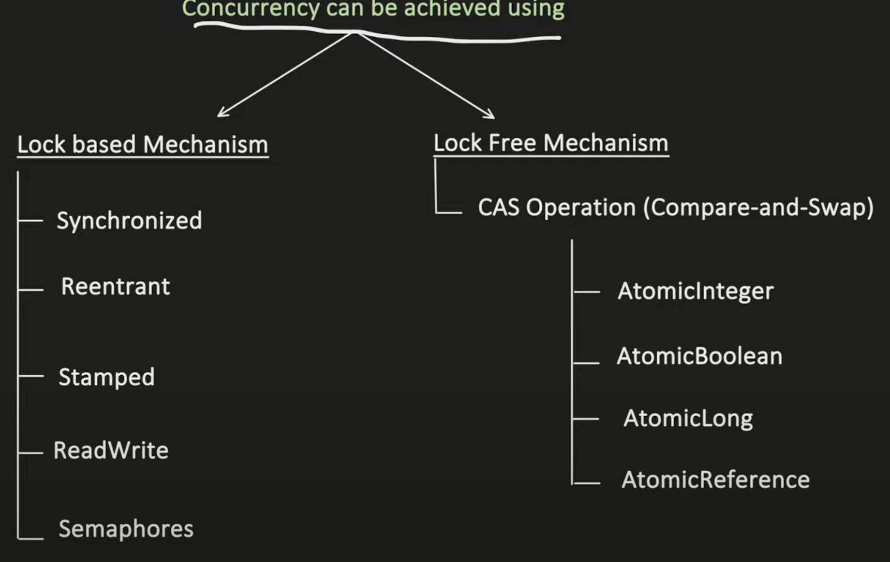
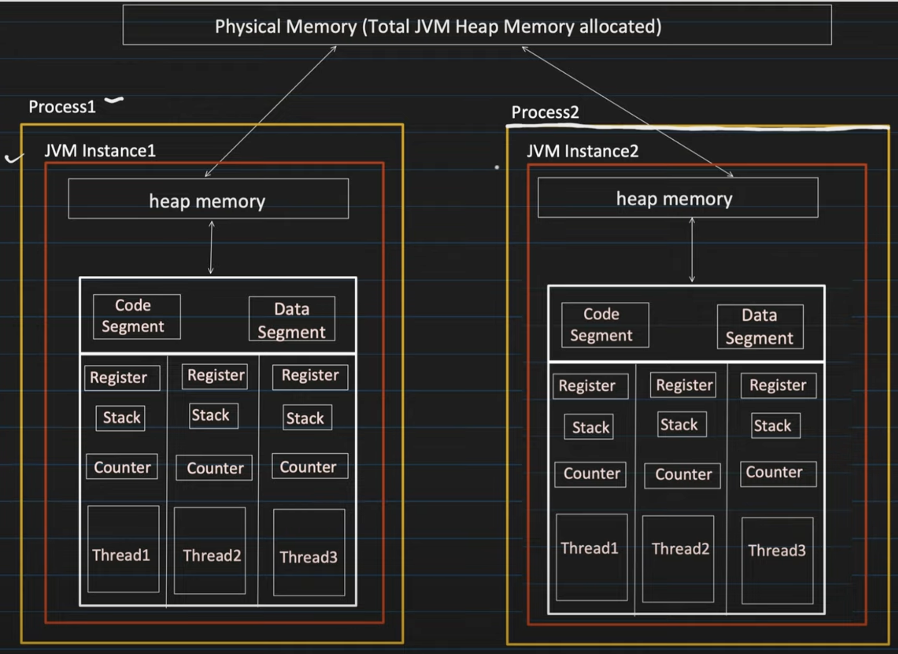
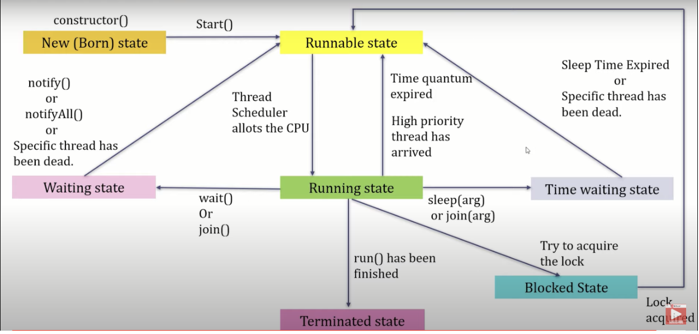
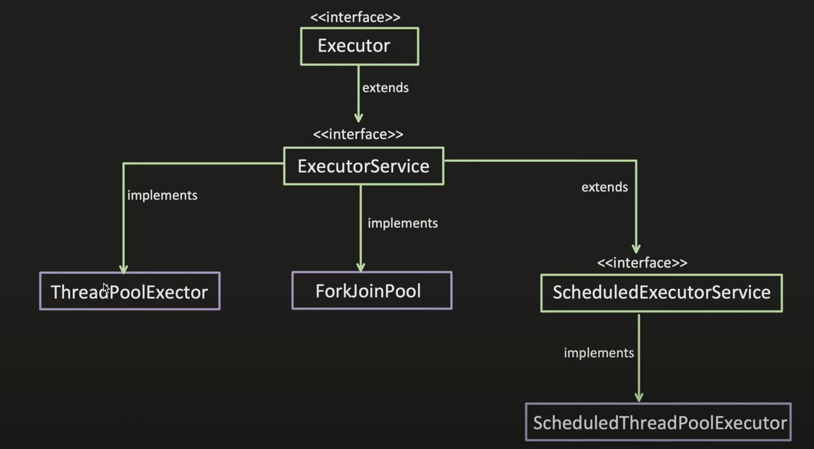
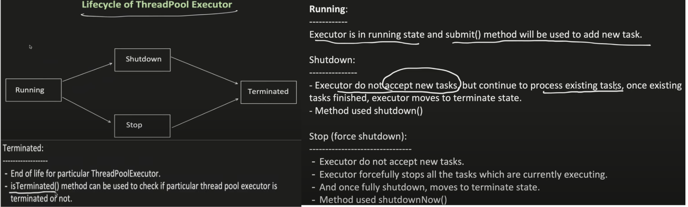
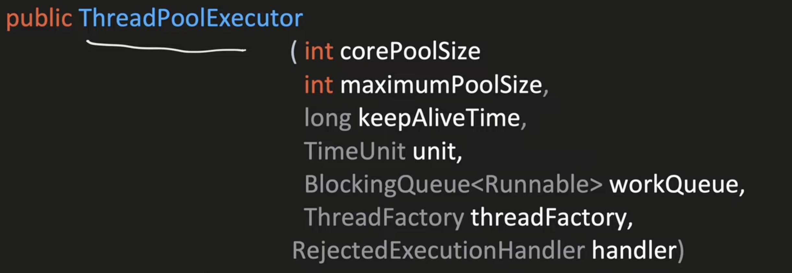
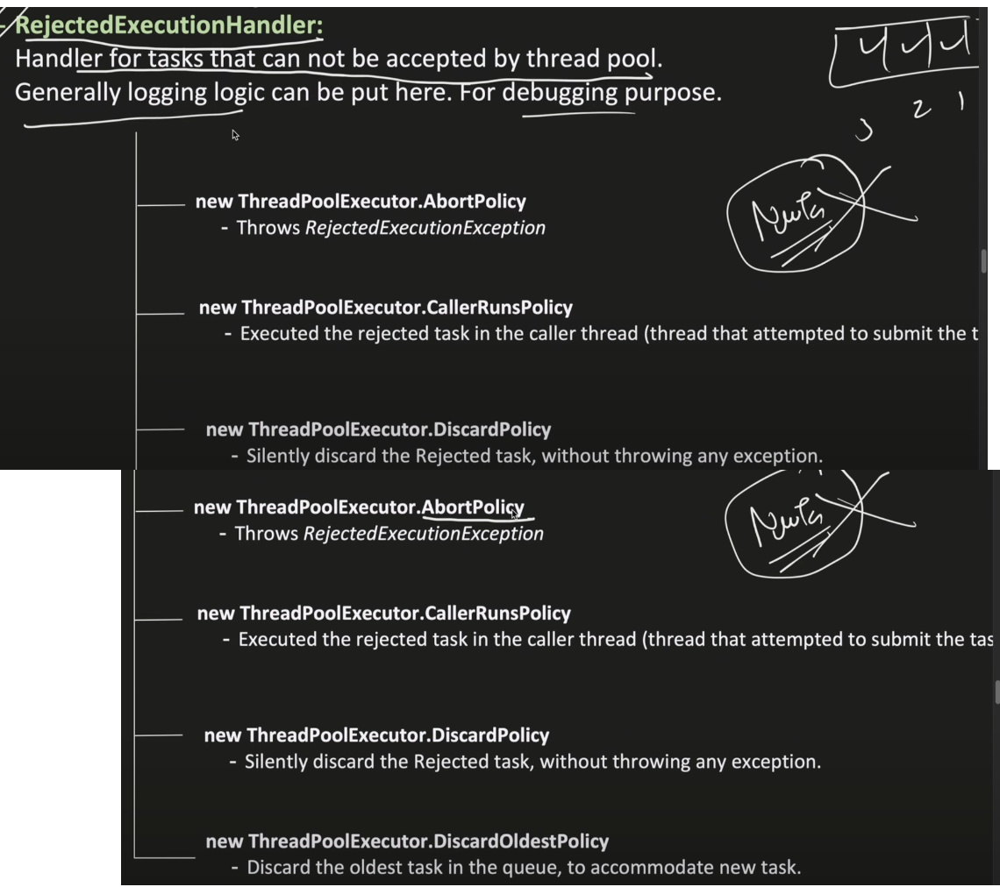
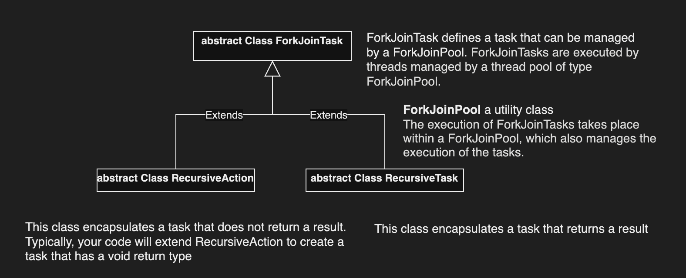

Overall Important Subtopics of Multithreading and Concurrency: 
----------------------------------------------------------------------------------------------------------

###  Introduction of Multithreading:
* **Definition of Multithreading**
* **Benefits and Challenges of Multithreading**
* **Processes v/s Threads**
* **Multithreading in Java**



---

###  Java Memory Model of Process and thread 


#### Creating Threads
**1. Extending the Thread Class** <br>

```MyThread.java```
```java
public static class MyThread extends Thread {
     public void run() {
          System.out.println("MyThread running");
          System.out.println("MyThread finished");
     }
}

    MyThread thred = new MyThread();
    thred.start();
```
**2. Implementing the Runnable Interface**<br>

```MyThread.java```
```java
public static class MyThread implements Runnable {
     public void run() {
          System.out.println("MyThread running");
          System.out.println("MyThread finished");
     }
}

    Thread thred = new Thread(new MyThread());
    thred.start();
```
**3. Implementing the Runnable Interface using anonymous class**<br>

```java
Runnable runnable = new Runnable() {
     public void run() {
          System.out.println("MyThread running");
          System.out.println("MyThread finished");
     }
};
    Thread thred = new Thread(runnable);
    thred.start();
```
**4. Implementing the Runnable Interface using lambda Expression**<br>

```java
Runnable runnable = () -> {
     System.out.println("MyThread running");
     System.out.println("MyThread finished");
};
    Thread thred = new Thread(runnable);
    thred.start();
```


#### Thread Lifecycle


---

### Inter Thread Communication and Synchronization
- Synchronization and Thread Safety
     - Synchronized Methods
     - Synchronized Blocks
- Inter-Thread Communication
     - wait(), notify(), and notifyAll() methods
     - **Producer-Consumer Problem**

```java
public class SharedResources {
    int size;
    Queue<Integer> queue;
    SharedResources(int size){
        this.size = size;
        this.queue = new LinkedList<>();
    }
    synchronized public void produce(int i) throws Exception{
        while(queue.size()==size){
            System.out.println("Buffer is full producer is waiting...");
            wait();
        }
        queue.offer(i);
        System.out.println("Produced: "+i);
        notifyAll();
        // Thread.currentThread().sleep(1000);
    }
    synchronized public void consume()throws Exception{
        while(queue.isEmpty()){
            System.out.println("Buffer is empty Consumer is waiting...");
            wait();
        }
        int item=queue.poll();
        System.out.println("Consumed: "+item+"  "+Thread.currentThread().getName());
        notifyAll();
    }
}
```

```java
SharedResources resources = new SharedResources(5);
Thread producerThread=new Thread(()->{
     try {
          for (int i=0; i<40;i++) {
               resources.produce(i);
          }
     } catch (Exception e) {
          System.out.println(e);
     }
});
Thread consumerThread=new Thread(()->{
     try {
          for (int i=0; i<20;i++) {
               resources.consume();
          }
     } catch (Exception e) {
          System.out.println(e);
     }
});
Thread consumerThread2=new Thread(()->{
     try {
          for (int i=0; i<20;i++) {
               resources.consume();
          }
     } catch (Exception e) {
          System.out.println(e);
     }
});
producerThread.start();
consumerThread.start();
consumerThread2.start();
```
---
### Lock can be acquired at both Class and Instance level
**1. Class Level locking**
```java
class InnerClass{
    static Lock lock = new ReentrantLock();

    static int counter=0;
    static void solve(){
            for(int i=0;i<100;i++){
               lock.lock();
               if("Thread-0".equals(Thread.currentThread().getName()))counter++;
               if("Thread-1".equals(Thread.currentThread().getName()))counter--;
               System.out.println(Thread.currentThread().getName()+" "+counter);
               lock.unlock();
          }
    }
}
```
```java
Thread t1=new Thread(InnerClass::solve);
Thread t2=new Thread(InnerClass::solve);

t1.start();
t2.start();
     
try {
     t1.join();
     t2.join();
} 
catch (Exception e) {
     e.printStackTrace();
}
finally{
     System.out.println("Fianlly Counter: "+innerClass1.counter+"............................");
}
System.out.println("Fianlly Counter: "+innerClass1.counter+"--------------------------------");    
```
**2. Instance Level locking**
```java
class InnerClass{
    Lock lock = new ReentrantLock();

    int counter=0;
    void solve(){
        // synchronized(this){
            for(int i=0;i<100;i++){
                lock.lock();
                if("Thread-0".equals(Thread.currentThread().getName())||"Thread-2".equals(Thread.currentThread().getName()))counter++;
                if("Thread-1".equals(Thread.currentThread().getName()))counter--;
                if("Thread-2".equals(Thread.currentThread().getName()))
                    try {
                        Thread.currentThread().sleep(100);
                    } catch (InterruptedException e) {
                        e.printStackTrace();
                    }
            System.out.println(Thread.currentThread().getName()+" "+counter);
            lock.unlock();
            // }
        }
    }
}
```
```java
InnerClass innerClass1 = new InnerClass();
InnerClass innerClass2 = new InnerClass();
Thread t1=new Thread(innerClass1::solve);
Thread t2=new Thread(innerClass1::solve);
t1.start();
t2.start();

System.out.println("=========================================================");

Thread t3=new Thread(innerClass2::solve);
t3.start();
try {
     // Thread.currentThread().sleep(15000);
     t1.join();
     t2.join();
     t3.join();
} 
catch (Exception e) {
     e.printStackTrace();
}
finally{
     System.out.println("innerClass1 Fianlly Counter: "+innerClass1.counter+"............................");
}

System.out.println("innerClass2 Fianlly Counter: "+innerClass2.counter+"--------------------------------");
```
---

* Stop, Resume, Suspended method is deprecated, understand why and its solution
* Thread Joining
* Volatile Keyword
* Thread Priority 
* Daemon Threads
---

## Thread Executor Framework

<br>


### 1. ThreadPoolExecutor





     1. corePoolSize the number of threads to keep in the pool, even if they are idle, unless {@code allowCoreThreadTimeOut} is set
     2. maximumPoolSize the maximum number of threads to allow in the pool
     3. keepAliveTime when the number of threads is greater than the core, this is the maximum time that excess idle threads will wait for new tasks before terminating.
     4. unit the time unit for the {@code keepAliveTime} argument
     5. workQueue the queue to use for holding tasks before they are executed.  This queue will hold only the {@code Runnable} tasks submitted by the {@code execute} method.
     6. threadFactory the factory to use when the executor creates a new thread
     7. handler the handler to use when execution is blocked because the thread bounds and queue capacities are reached

### Executors -> Utility Class

```java
import java.util.concurrent.ArrayBlockingQueue;
import java.util.concurrent.ExecutorService;
import java.util.concurrent.Executors;
import java.util.concurrent.RejectedExecutionHandler;
import java.util.concurrent.ThreadFactory;
import java.util.concurrent.ThreadPoolExecutor;
import java.util.concurrent.TimeUnit;

class CustomThreadFactory implements ThreadFactory {

    @Override
    public Thread newThread(Runnable r) {
        return new Thread(r);
    }
}

class CustomRejectedHandler implements RejectedExecutionHandler {

    @Override
    public void rejectedExecution(Runnable r, ThreadPoolExecutor executor) {
        System.out.println("Task denied: " + r.toString());
    }

}

public class Sample4 {
    public static void main(String[] args) {
        ThreadPoolExecutor poolExecutor = new ThreadPoolExecutor(2, 5, 1, TimeUnit.HOURS, new ArrayBlockingQueue<>(10),
                new CustomThreadFactory(), new CustomRejectedHandler());
        poolExecutor.allowCoreThreadTimeOut(true);
        // submit task
        for (int i = 0; i < 25; i++)
            poolExecutor.submit(() -> {
                try {
                    Thread.sleep(5000);
                    System.out.println("Thread Name: " + Thread.currentThread().getName());
                } catch (Exception e) {
                    e.printStackTrace();
                }
            });
        poolExecutor.shutdown();

        ExecutorService executor = Executors.newScheduledThreadPool(2);

        for (int i = 1; i <= 10; i++) {
            final int taskNumber = i;
            executor.submit(() -> {
                System.out.println("Hello World!..: " + taskNumber + " ->" + Thread.currentThread().getName());
                try {
                    Thread.sleep(5000); // Simulate some work
                } catch (InterruptedException e) {
                    Thread.currentThread().interrupt();
                    System.err.println("Task interrupted: " + e.getMessage());
                }
            });
        }

        try {
            if (!executor.awaitTermination(20, TimeUnit.SECONDS)) {
                executor.shutdownNow(); // Force shutdown if timeout reached
            }
        } catch (InterruptedException e) {
            e.printStackTrace();
        }
        System.out.println("Main Thread Finished Execution");
    }
}

```
### 2. Fork/Join Framework ( Parallel Programming )
     


```java
class SqrtTransform extends RecursiveAction {
    // The threshold value is arbitrarily set at 1,000 in this example. In real-world code, its optimal value can be determined by profiling and experimentation.
    final int seqThreshold = 3;
    double[] data;  // Array to be accessed.
    int start, end; // Determines what part of data to process.

    SqrtTransform(double[] vals, int s, int e) {
        data = vals;
        start = s;
        end = e;
    }

    // This is the method in which parallel computation will occur.
    @Override
    protected void compute() {
        // If number of elements is below the sequential threshold, then process sequentially.
        if ((end - start) < seqThreshold) {
            // Transform each element into its square root.
            for (int i = start; i < end; i++) data[i] = Math.sqrt(data[i]);
        } 
        else {
            // Otherwise, continue to break the data into smaller pieces.
            int middle = (start + end) / 2; // Find the midpoint.
            // Invoke new tasks, using the subdivided data.
            invokeAll(new SqrtTransform(data, start, middle),new SqrtTransform(data, middle, end));
        }
    }
}

// Demonstrate parallel execution.
public class Main {
    public static void main(String args[]) {
        // Create a task pool.
        ForkJoinPool fjp = new ForkJoinPool();
        double[] nums = new double[100000];
        // Give nums some values.
        for (int i = 0; i < nums.length; i++) nums[i] = (double) i;
        System.out.println("A portion of the original sequence:");
        for (int i = 0; i < 10; i++) System.out.print(nums[i] + " ");
        System.out.println("\n");

        SqrtTransform task = new SqrtTransform(nums, 0, nums.length);
        // Start the main ForkJoinTask.
        fjp.invoke(task);

        System.out.println("A portion of the transformed sequence (to four decimal places):");
        for (int i = 0; i < 10; i++) System.out.format("%.4f ", nums[i]);
    }
}
```
```java
// A RecursiveTask that computes the summation of an array of doubles.
class Sum extends RecursiveTask<Double> {
    final int seqThresHold = 500;  // The sequential threshold value.
    double[] data;  // Array to be accessed.
    int start, end;  // Determines what part of data to process.

    Sum(double[] vals, int s, int e) {
        data = vals;
        start = s;
        end = e;
    }

    // Find the summation of an array of doubles.
    @Override
    protected Double compute() {
        double sum = 0;
        // If number of elements is below the sequential threshold, then process sequentially.
        if ((end - start) < seqThresHold) {
            // Sum the elements.
            for (int i = start; i < end; i++)
                sum += data[i];
        } else {
            // Otherwise, continue to break the data into smaller pieces. Find the midpoint.
            int middle = (start + end) / 2;
            // Invoke new tasks, using the subdivided data.
            Sum subTaskA = new Sum(data, start, middle), subTaskB = new Sum(data, middle, end);
            
            // Start each subtask by forking.
            subTaskA.fork();
            subTaskB.fork();
        
            sum = subTaskA.join() + subTaskB.join();  // Wait for the subtasks to return, and aggregate the results.
        }
        
        return sum;   // Return the final sum.
    }
}

// Demonstrate parallel execution.
public class Main {
    public static void main(String args[]) {
        ForkJoinPool fjp = new ForkJoinPool();  // Create a task pool.
        double[] nums = new double[5000];
        // Initialize nums with values that alternate between positive and negative.
        for (int i = 0; i < nums.length; i++) nums[i] = (double) (((i % 2) == 0) ? i : -i);
        Sum task = new Sum(nums, 0, nums.length);
        
        double summation = fjp.invoke(task); // Start the ForkJoinTasks. Notice that, in this case, invoke() returns a result.
        
        System.out.println("Summation " + summation);
    }
}
```
### 3. ScheduledThreadPoolExecutor
```java
import java.util.concurrent.ScheduledThreadPoolExecutor;
import java.util.concurrent.TimeUnit;

public class Sample6 {
    public static void main(String[] args) {
        ScheduledThreadPoolExecutor executor = new ScheduledThreadPoolExecutor(2);
        executor.submit(() -> {
            System.out.println("Hello World! from ScheduledThreadPoolExecutor");
            try {
                Thread.sleep(5000); // Simulate some work
            } catch (InterruptedException e) {
                Thread.currentThread().interrupt();
                System.err.println("Task interrupted: " + e.getMessage());
            }
        });

        executor.scheduleAtFixedRate(() -> {
            try {
                System.out.println("Executing task at: " + System.currentTimeMillis());
                // Simulate some work
                Thread.sleep(1000);
            } catch (InterruptedException e) {
                Thread.currentThread().interrupt();
                System.err.println("Task interrupted: " + e.getMessage());
            }
        }, 0, 2, java.util.concurrent.TimeUnit.SECONDS);

        // Optional: Shutdown the executor after some time
        Runtime.getRuntime().addShutdownHook(new Thread(() -> {
            System.out.println("Shutting down executor...");
            executor.shutdown();
            try {
                if (!executor.awaitTermination(5, java.util.concurrent.TimeUnit.SECONDS)) {
                    System.err.println("Executor did not terminate in the specified time.");
                    executor.shutdownNow();
                }
            } catch (InterruptedException e) {
                System.err.println("Shutdown interrupted: " + e.getMessage());
                executor.shutdownNow();
            }
        }));

        // Keep the main thread alive to see the scheduled task execution
        try {
            Thread.sleep(20000); // Keep the main thread alive for 10 seconds
        } catch (InterruptedException e) {
            Thread.currentThread().interrupt();
            System.err.println("Main thread interrupted: " + e.getMessage());
        }

        try {
            if (!executor.awaitTermination(10, TimeUnit.SECONDS)) {
                executor.shutdownNow(); // Force shutdown if timeout reached
            }
        } catch (InterruptedException e) {
            e.printStackTrace();
        }

        System.out.println("Main thread finished execution.");

    }

}

```
### 4. Callable and Future
Callable and Future are key interfaces in Java's concurrency framework that allow you to execute tasks asynchronously and retrieve results later.

#### Callable Interface -> It is similar to Runnable but can return a result and throw checked exceptions.
#### Future Interface -> It represents the result of an asynchronous computation
```java
import java.util.concurrent.Callable;
import java.util.concurrent.ExecutorService;
import java.util.concurrent.Executors;
import java.util.concurrent.Future;
import java.util.concurrent.TimeUnit;

public class Sample9 {
    public static void main(String[] args) {
        ExecutorService executor = Executors.newSingleThreadExecutor();
        Callable<Integer> task = () -> {
            TimeUnit.SECONDS.sleep(2);
            return 42; // Return a result
        };
        executor.submit(task);
        // Submit Callable and get Future
        Future<Integer> future = executor.submit(() -> {
            TimeUnit.SECONDS.sleep(5);
            return 123;
        });

        // Do other work while task is executing...

        try {
            System.out.println("Callable task result: " + task.call());

            if (future.isDone()) {
                System.out.println("Task is already done.");
            } else {
                System.out.println("Task is still running...");
                // Integer result = future.get(2, TimeUnit.SECONDS);
                // System.out.println("Result: " + result);
                // future.cancel(false); // Attempt to cancel the task
            }

            // Get the result (blocks if not ready)
            Integer result = future.get();
            System.out.println("Result: " + result);
        } catch (Exception e) {
            System.err.println("Error occurred: " + e.getMessage());
        } finally {
            if (!future.isCancelled()) {
                System.out.println("Task completed successfully.");
            } else {
                System.out.println("Task was cancelled.");
            }
            executor.shutdown();
        }

    }
}
```

### 5. ThreadLocal in Multithreading
```java
public class Sample8 {
    public static void main(String[] args) {
        ThreadLocal<String> threadLocal = new ThreadLocal<>();
        threadLocal.set("Hello, ThreadLocal!");
        Thread thread = new Thread(() -> {
            threadLocal.set("Hello from new thread!");
            String value = threadLocal.get();
            System.out.println("\nThreadLocal value in new thread: " + value);
        });
        thread.start();
        try {
            Thread.sleep(1000);
        } catch (Exception e) {

        }
        System.out.println("\nMain thread value: " + threadLocal.get());
    }

}

```

---

### Concurrency Utilities
* java.util.concurrent Package
* Executors and ExecutorService
* Callable and Future
* CompletableFuture
* ScheduledExecutorService
* CountDownLatch, CyclicBarrier, Phaser, and Exchanger
---

###  Concurrent Collections
- ConcurrentHashMap
- ConcurrentLinkedQueue and ConcurrentLinkedDeque
- CopyOnWriteArrayList
- BlockingQueue Interface
     - ArrayBlockingQueue
     - LinkedBlockingQueue
     - PriorityBlockingQueue
---

###  Atomic Variables
* AtomicInteger, AtomicLong, and AtomicBoolean
* AtomicReference and AtomicReferenceArray
* Compare-and-Swap Operations
---

###  Locks and Semaphores
* ReentrantLock
* ReadWriteLock
* StampedLock
* Semaphores
* Lock and Condition Interface
---

### Best Practices and Patterns
* Thread Safety Best Practices
* Immutable Objects
* ThreadLocal Usage
* Double-Checked Locking and its Issues
* Concurrency Design Patterns
---

###  Common Concurrency Issues and Solutions
* Deadlocks
* Starvation
* Livelocks
* Race Conditions
* Strategies for Avoiding Concurrency Issues
---

-  Parallel Streams (already discussed during Stream topic, will provide working example for this)
---

-  Java 9+ Features
     * Reactive Programming with Flow API
     * CompletableFuture Enhancements
     * Process API Updates
---

-  Java 11+ Features
     * Local-Variable Type Inference (var keyword)
     * Enhancements in Optional class
     * New Methods in the String class relevant to concurrency
----